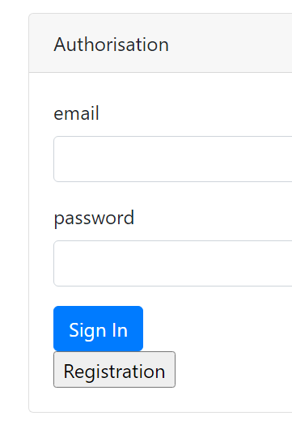
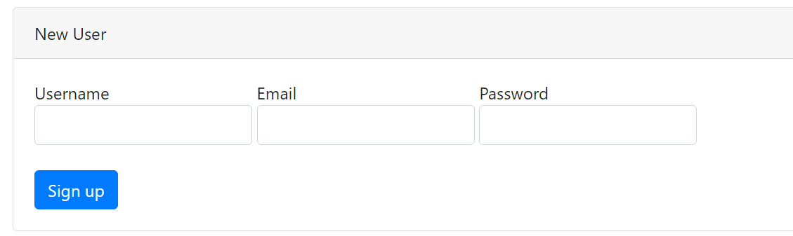
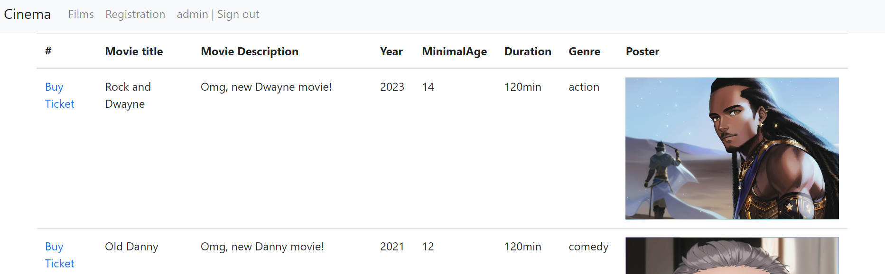
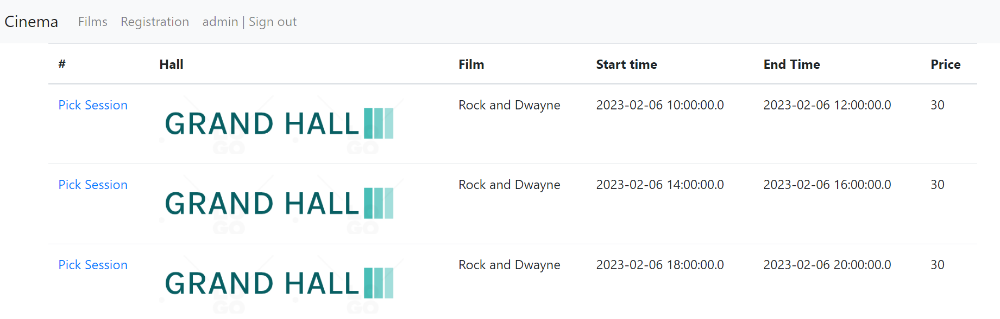
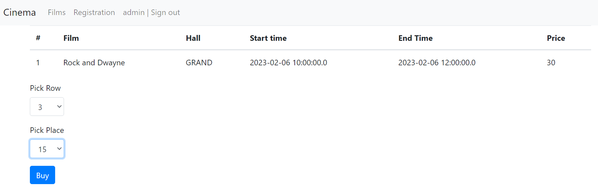
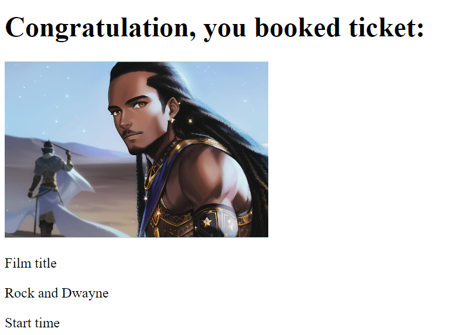

<h1>job4j_cinema</h1>

Project "CINEMA" is a service for booking movie tickets. The project was created as a part of the learning activity. Spring Boot technology is used in the project.
At the request of any page, the current filmSession is filtered through java.servlet.Filter and the user is redirected to the authorization page. 
Only the authorized user can create/edit films and buy tickets. All entries are saved in the database.

Technologies used in the project:
- Spring boot 2.5.2
- Thymeleaf,
- Bootstrap,
- PostgreSQL 42.2.9
- Junit 5.7.0
- AssertJ 3.23.1
- log4j 1.2.17
- JCIP Annotations 1.0
- DBCP 2 2.7.0
- h2database 1.4.200
- checkstyle-plugin 3.1.2
- puppycrawl 9.0
- Liquibase 3.6.2

Required environment:
- Java 17
- Maven 3.8
- PostgreSQL 14

To run the application you need:

1. Create a database named cinema
```ql
    create database cinema;
```

2. Build the project and run the Spring Boot application
```
    mvn clean install
    mvn spring-boot:run
```

### Login and user registration pages:



### Main page with a list of movies and sessions:



### Purchase confirmation page, success and already booked page:




Movie posters were generated with Different Dimension Me
Logos generated with logo.com

If you have any questions about this project, please email me at kuptsovns@gmail.com

